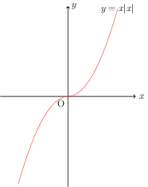

Assume $f(x)$ have $L$- Lipschitz continuous gradient, then as long as the stepsize $\alpha\in(0, \frac{2}{L})$. Then the sequence $\{x^k\}_{k=0}^{+\infty}$ generated by the gradient descent,

$$
x^{k+1} \leftarrow x^{k} - \alpha \nabla f(x^k)
$$

* either $f(x^k)\rightarrow -\infty$

* or $\|\nabla f(x^k)\|\rightarrow 0$, that is the iterates converge to stationary point.

Proof.

Since $f(x)$  has $L$- Lipschitz continuous gradient, then we have 
$$
\begin{aligned} 
f(x^{k+1}) & 
\leq f(x^{k})+ (x^{k+1}-x^k)^T\nabla f(x^k)+\frac{L}{2}\|x^{k+1}-x^k\|^{2} \\ 
&=f(x^k)-\alpha\left(1-\frac{\alpha}{2} L\right)\left\|\nabla f(x^k)\right\|^{2}. 
\end{aligned}
$$
To make each step is *descent*, then we require $\alpha\left(1-\frac{\alpha}{2} L\right)>0$, which is equivalent to require $\alpha\in(0, \frac{2}{L})$. Therefore the sequence $\{f(x^k)\}$ is a strictly descreasing sequence, which either converge or goes to $-\infty$. Even if $\{f(x^k)\}$ converges, it doesn't not necessarily converge to the global minimum.

Assume the global minimum of $f(x)$, $f^*$, is finite. For any  $\alpha\in(0, \frac{2}{L})$, denote $c=\frac{1}{\alpha\left(1-\frac{\alpha}{2} L\right)}$, then we have
$$
\left\|\nabla f(x^k)\right\|^{2}\leq c (f(x^k) - f(x^{k+1})).
$$
Further, we have
$$
\sum_{k=0}^N\left\|\nabla f(x^k)\right\|^{2}\leq c (f(x^0) - f(x^{N+1})) \leq c(f(x^0) - f^*).
$$
Let $N\rightarrow +\infty $, we conclude $\left\|\nabla f(x^k)\right\|$ converges to $0$, as the RHS is a finite constant.

Remark1: This lemma dosen't assume any convexity in $f(x)$, hence even if $\{f(x^k)\}$ converges, it doesn't not necessarily converge to the global minimum. Instead, we are more care about the property of the gradient sequence. 

Remark2: A non-convex function can also has $L$-Lipschitz continuous gradient. For example, $f(x)=x|x|, x\in \mathbb{R}$ with $L=2$.

Now Let's add the convexity assumption on the function $f$. We further assume $f$ attain its finite minimum, $f^*$, at $x^*$. Then we have following results,
$$
f(x^k) - f^* \leq \frac{2L}{k+4}\|x_0-x^*\|\overset{\Delta}{=}\mathcal{O}(\frac{1}{k}).
$$
