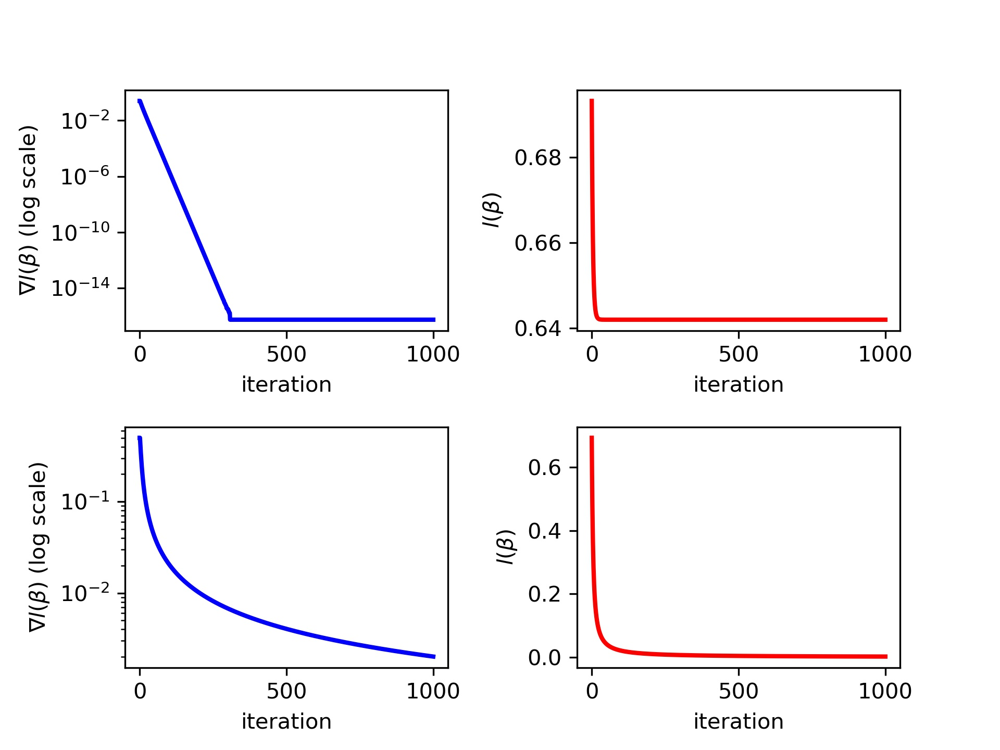

# Problem Formulation

There are commonly two formulation of the logistic regression, depending on the way we label the response variable $y$.

**First Formulation:**

Consider restrict $y$ to $\{-1,1\}$. Then we have
$$
\begin{aligned}
&\mathbb{P}(y=1|z)=\sigma(z)=\frac{1}{1 + e^{-z}}\\
&\mathbb{P}(y=-1|z)=\sigma(z)=\frac{1}{1 + e^z},
\end{aligned}
$$
which can be compactly wirtten as 
$$
\mathbb{P}(y|z)=\sigma(zy).
$$
**Second Formulation:**

Consider restrict $y$ to $\{0,1\}$. Then we have
$$
\begin{aligned}
&\mathbb{P}(y=1|z)=\sigma(z)=\frac{1}{1 + e^{-z}}\\
&\mathbb{P}(y=0|z)=\sigma(z)=\frac{1}{1 + e^z},
\end{aligned}
$$
which can be compactly wirtten as 
$$
\mathbb{P}(y|z)=\sigma(z)^y(1-\sigma(z))^{1-y}.
$$
If we consider the data $\{x_i,y_i\}_{i=1}^N$ and we want to use the Likelihood Principle to fit the Logistic Regression, then we would like to maximize the following loss function,
$$
\begin{aligned}
&	L(\beta_0,\beta) = \prod_{i=1}^N \mathbb{P}(y_i|z_i)\\
& z_i =\beta_0+\beta^Tx_i,.
\end{aligned}
$$
If we use the first formulation, then it is equivalent to minimize the log-negative $L(\beta_0,\beta)$,
$$
\begin{aligned}
\min_{\beta_0,\beta}l(\beta_0,\beta)=\frac{1}{N}\sum_{i=1}^N[-y_iz_i+\log(1+e^{z_i})].
\end{aligned}
$$
If we use the second formulation, then it is equivalent to
$$
\begin{aligned}
\min_{\beta_0,\beta}l(\beta_0,\beta)=\frac{1}{N}\sum_{i=1}^N\log(1+e^{-y_iz_i}).
\end{aligned}
$$
From now on, we will focus on the second formulation. And for the sake of simplicity, we drop the intercept term $\beta_0$.

# Motivating Examples

Consider two simulated datasets:

Dataset 1:

| $x_1$ | $x_2$ | $y$  |
| ----- | ----- | ---- |
| 1     | 0     | 1    |
| 2     | 0     | -1   |

Dataset 2:

| $x_1$ | $x_2$ | $y$  |
| ----- | ----- | ---- |
| 1     | 0     | 1    |
| -1    | 0     | -1   |

Applying the gradient descent with constant stepsize $\frac{1}{L}$ on each dataset for 1000 steps, then we obtain the estimations as follows.

| Dataset | $\beta_1$   | $\beta_2$ |
| ------- | ----------- | --------- |
| 1       | -0.41961762 | 0         |
| 2       | 6.20695009  | 0         |

Also we plot out following figures to check the convergence. The top two figures describe the algorithm's performance on the dataset 1 while the bottom two is for the  dataset 2.

# Appendix

**Deriviation of the gradient and Hessian of the loss function:**

Consider $f(\beta)=\log (1 + \exp(-y\beta^Tx)$, then we have
$$
\begin{aligned}
&\nabla f(\beta) = \frac{1}{1 + \exp(y\beta^Tx)}(-yx)\\
&\nabla^2 f(\beta) = (yx)\frac{\exp(y\beta^Tx)}{1 + \exp(y\beta^Tx)}(yx^T),
\end{aligned}
$$
which implies
$$
\begin{aligned}
& \nabla l(\beta)=\frac{1}{N}\sum_{i=1}^N \frac{1}{1 + \exp(y_i\beta^Tx_i)}(-y_ix_i)\\
& \nabla^2 l(\beta)=\frac{1}{N}\sum_{i=1}^N(y_ix_i)\frac{\exp(y\beta^Tx_i)}{1 + \exp(y\beta^Tx_i)}(y_ix_i^T)=\frac{1}{N}XDX^T,
\end{aligned}
$$
where $X=[x_1,\cdots,x_n]$ , $D=\text{diag}\{y_1^2\sigma_1,\cdots,y_n^2\sigma_n\}$ , and $\sigma_i =\frac{\exp(y\beta^Tx_i)}{1 + \exp(y\beta^Tx_i)} $.