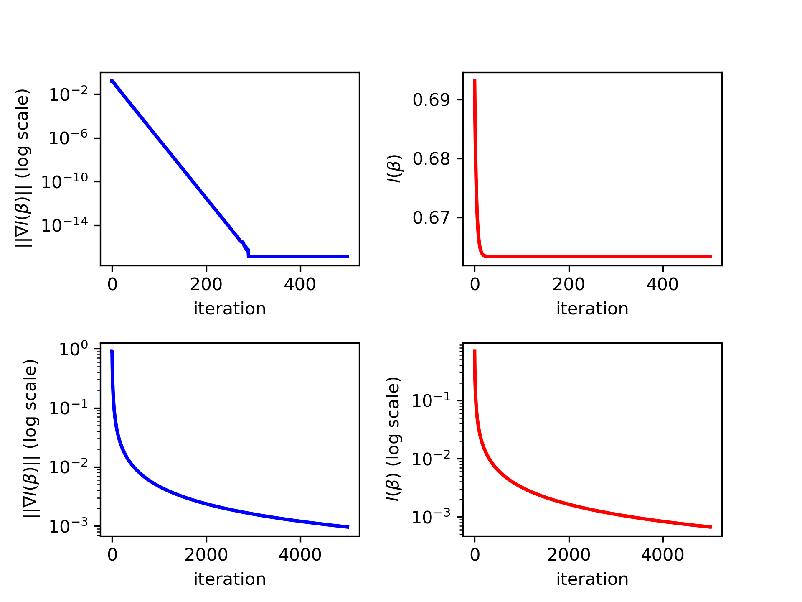
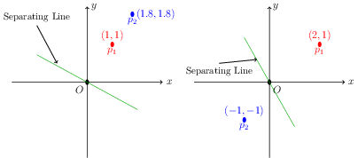
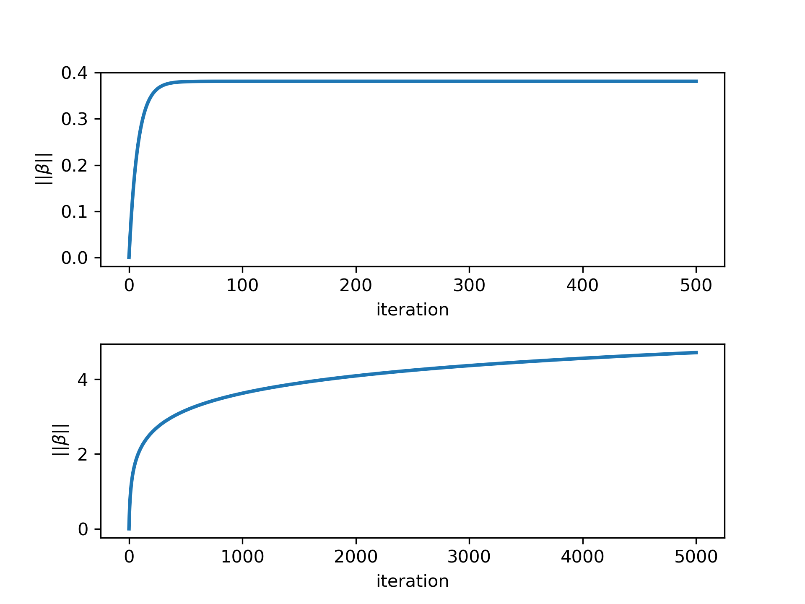
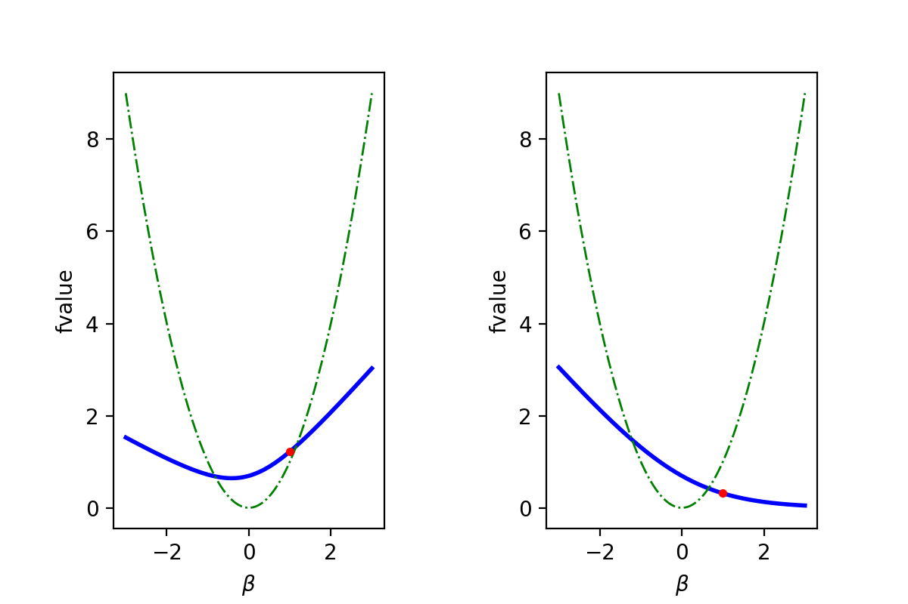
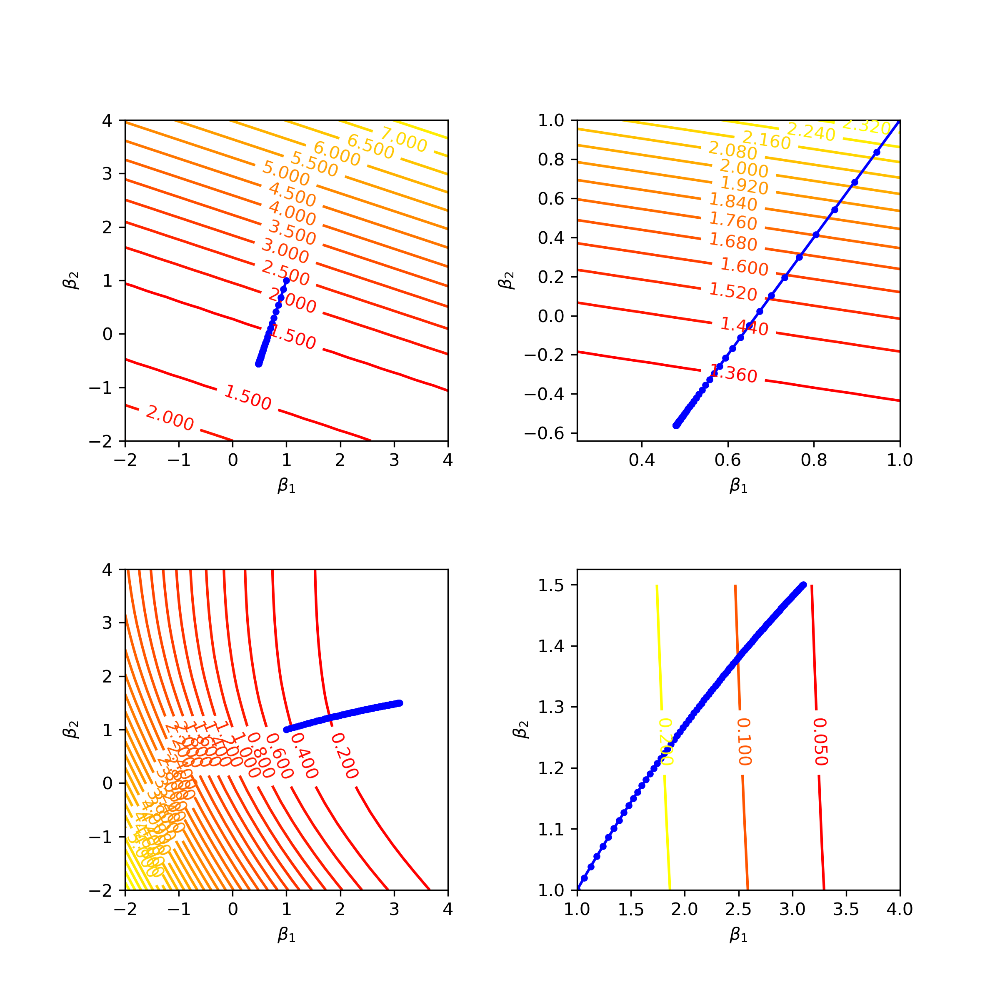

# Problem Formulation

There are commonly two ways of formulating the logistic regression problem, depending on the way we label the response variable $y$. Here we focus on the first formulation and defer the second formulation on the appendix.

**First Formulation:**

Consider restrict $y$ to $\{-1,1\}$. Then we have
$$
\begin{aligned}
&\mathbb{P}(y=1|z)=\sigma(z)=\frac{1}{1 + e^{-z}}\\
&\mathbb{P}(y=-1|z)=\sigma(z)=\frac{1}{1 + e^z},
\end{aligned}
$$
which can be compactly written as 
$$
\mathbb{P}(y|z)=\sigma(zy).
$$
If we consider the data $\{x_i,y_i\}_{i=1}^N$ and we want to use the Likelihood Principle to fit the Logistic Regression, then we would like to maximize the following loss function,
$$
\begin{aligned}
&	L(\beta_0,\beta) = \prod_{i=1}^N \mathbb{P}(y_i|z_i)\\
& z_i =\beta_0+\beta^Tx_i.
\end{aligned}
$$
Then it is equivalent to minimize the log-negative of $L(\beta_0,\beta)$,
$$
\begin{aligned}
\min_{\beta_0,\beta}l(\beta_0,\beta)=\frac{1}{N}\sum_{i=1}^N\log(1+e^{-y_iz_i}).
\end{aligned}
$$
From now on,  for the sake of simplicity, we drop the intercept term $\beta_0$.

# Motivating Example

Consider two simulated datasets:

Dataset 1:

| $x_1$ | $x_2$ | $y$  |
| ----- | ----- | ---- |
| 0.3   | 0.9   | 1    |
| 0.5   | 1.5   | -1   |

Dataset 2:

| $x_1$ | $x_2$ | $y$  |
| ----- | ----- | ---- |
| 2     | 1     | 1    |
| -1    | -1    | -1   |

 **Some Analysis:**

1. The objective function $l(\beta)$ is strictly convex by looking at its Hessian, which is positive defined. However, it is not strongly convex.
2. For given Data set, the Hessian is upper bounded by $(\sum_{i=1}^N\|x_i\|^2)I$ (see Appendix).
3. The stepsize can be chosen as $\alpha = \frac{1}{\sum_{i=1}^N\|x_i\|^2}$.

Applying the gradient descent with constant stepsize $\frac{1}{L}$ on each dataset for 1000 steps, then we obtain the estimations as follows.

| Dataset | $\beta_1$   | $\beta_2$   |
| ------- | ----------- | ----------- |
| 1       | -0.12058225 | -0.36174676 |
| 2       | 3.59370507  | 3.04825501  |

Also we plot out following figures to check the convergence. The top two figures describe the algorithm's performance on the dataset 1 while the bottom two is for the  dataset 2.

Fig1: Apply GD with the constant stepsize on two different datasets. The blue curves depicts how the norm of gradient at iterates change while the red curves show the change of the function value in each iteration.

# Analysis: why this happens?

First, if we want to minimize $f(\beta)=\log(1 + \exp(-\beta))$ using gradient descent with constant stepsize $\frac{1}{L}$, then we will facing following issues. Here we assume $\beta \in \mathbb{R}$.

1. The global minimal is not attainable, i.e., $+\infty$, though we can have $\nabla f(\beta^k)\rightarrow 0$, which means $\beta \rightarrow +\infty$, hence the iterates diverge.
2. Indeed,  the $\{f(\beta^k)\}$ converges to $f^*=0$ by as it monotonously decreasing and lower bounded by $0$.
3. The worst-case iteration complexity is $\mathcal{O}(\frac{1}{k})$, indicating a sublinear convergence rate.

Now, let's back to the example. The figure 2 shows that the first dataset and second dataset, which correspond to the **non-separable** and **separable** case respectively.

Fig2: (Left) First dataset. (Right) Second dataset. The fitted separating line is derived by $y=-\frac{\beta_1}{\beta_2}x$.

We also plot out the norm of iterates at each iteration in figure 3. 

Fig3: The top figure shows the norm of iterates for the first dataset while the bottom one shows case for the second dataset.

We can see that for non-separable case, the norm of iterates are bounded while the latter goes to infinity (if we increase the number of iterations).

In non-separable case, $\{\beta^k\}$ *seems*  to stay in "strongly convex" region while in separable case, $\{\beta^k\}$ keeps approaching the flatten region, so you can easily say a sharp decreasing in convergence speed. The following observations can be verified by figure 4 (1-dimensional case) and figure 5 (2-dimensional case).

Fig4:  (Left) Non-separable dataset  $\{(x_1=1, y_1=1), (x_2=2, y_2=-1)\}$.  The green dot line is $y=x^2$. The objective function (blue line) preserves the strong convexity in a certain range and the minimal stays in this range. The red point is the start point $x_0$.  (Right). Separable dataset $\{(x_1=1, y_1=1), (x_2=-1, y_2=-1)\}$. Although the  objective function is endowed with the strong convexity property in a certain range, however the global minimal is outside of this range.

Fig5:  Dataset 1 is shown in the top 2 pictures with the right one zooming into a particular range. Dataset 2 is shown in the bottom pictures.  The blue dots trace the progression of iterates.

# Questions

1. Why the separability would cause such a difference? From the Fig4 and Fig5, we know data as *parameters* can influence the shape of the objective function a lot.  Given the data set,  can we predict the behavior of the performance of gradient descent with constant stepsize, i.e., linear convergence rate or sublinear convergence rate? Can we extend our conclusion to higher dimension?
2. In real world application, it's likely that the data is semi-separable, i.e., most data points can be split into two groups with a few exceptions. How's that influence the performance of the algorithm?
3. Will second formulation (see below) also encounter the similar issue? My guess is yes.

# Appendix

## Second Formulation of Logistic Regression

Consider restrict $y$ to $\{0,1\}$. Then we have
$$
\begin{aligned}
&\mathbb{P}(y=1|z)=\sigma(z)=\frac{1}{1 + e^{-z}}\\
&\mathbb{P}(y=0|z)=\sigma(z)=\frac{1}{1 + e^z},
\end{aligned}
$$
which can be compactly written as 
$$
\mathbb{P}(y|z)=\sigma(z)^y(1-\sigma(z))^{1-y}.
$$

If we use the second formulation, then maximizing the likelihood  is equivalent to

$$
\begin{aligned}
\min_{\beta_0,\beta}l(\beta_0,\beta)=\frac{1}{N}\sum_{i=1}^N[-y_iz_i+\log(1+e^{z_i})].
\end{aligned}
$$

## Derivation of the gradient and Hessian of the loss function

Consider $f(\beta)=\log (1 + \exp(-y\beta^Tx)$, then we have
$$
\begin{aligned}
&\nabla f(\beta) = \frac{1}{1 + \exp(y\beta^Tx)}(-yx)\\
&\nabla^2 f(\beta) = (yx)\frac{\exp(y\beta^Tx)}{1 + \exp(y\beta^Tx)}(yx^T),
\end{aligned}
$$
which implies
$$
\begin{aligned}
& \nabla l(\beta)=\frac{1}{N}\sum_{i=1}^N \frac{1}{1 + \exp(y_i\beta^Tx_i)}(-y_ix_i)\\
& \nabla^2 l(\beta)=\frac{1}{N}\sum_{i=1}^N(y_ix_i)\frac{\exp(y\beta^Tx_i)}{1 + \exp(y\beta^Tx_i)}(y_ix_i^T)=\frac{1}{N}XDX^T,
\end{aligned}
$$
where $X=[x_1,\cdots,x_n]$ , $D=\text{diag}\{y_1^2\sigma_1,\cdots,y_n^2\sigma_n\}$ , and $\sigma_i =\frac{\exp(y\beta^Tx_i)}{1 + \exp(y\beta^Tx_i)} $. 

**Reference: **

1. Lecture notes 9 and 10 presented on this [course website.](https://wiki.illinois.edu/wiki/display/ie510/IE+510+Applied+Nonlinear+Programming+Home)
2. The code for generating graphs can be found in [my git repo](https://github.com/Rothdyt/all_of_optimization/blob/master/_draft/Algorithms/pycode/LogisticRegression.py).
3. Formulations of Logistic Regression can be found in this [thread](https://stats.stackexchange.com/questions/250937/which-loss-function-is-correct-for-logistic-regression/279698#279698).

