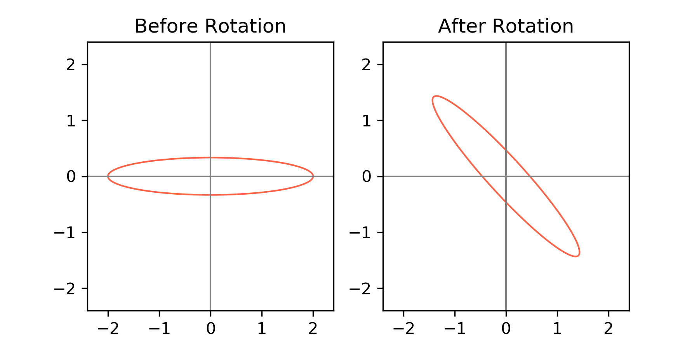

 
 Eigenvalue Problems
 

[TOC]

# Eigenvalue and Eigenvectors

**Motivating Example:**  Consider a unit sphere in $\mathbf{R^2}$, 
$$
\begin{bmatrix}x & y\end{bmatrix} \begin{bmatrix}1 & 0 \\ 0 & 3\end{bmatrix}\begin{bmatrix}x\\y\end{bmatrix} = 1,
$$

with semi-major axis and semi-minor axis equal to $1$ and $1/3$ respectively. Now, we rotate this ellipsoid $45^\circ$counterclockwise, which can be done by 
$$
\begin{bmatrix}1 & 0 \\ 0 & 3\end{bmatrix}\Rightarrow
\begin{bmatrix}2 & -1 \\ -1 & 2\end{bmatrix}.
$$

This transformation derived by 
$$
(\frac{1}{\sqrt{2}}\begin{bmatrix}1 & 1 \\ 1 & -1 \end{bmatrix})
\underbrace{\begin{bmatrix}1 & 0 \\ 0 & 3\end{bmatrix}}_{A}
(\frac{1}{\sqrt{2}}\begin{bmatrix}1 & 1 \\ 1 & -1 \end{bmatrix}) =\begin{bmatrix}2 & -1 \\ -1 & 2\end{bmatrix},
$$
where $1,3$ are two eigenvalues of the matrix $A$, which are the reciprocal of the length of the two semi-axes respectively and $[1,1]^T$ and $[1,-1]^T$ are eigenvectors of the matrix $A$, which are the new semi-axes.

# Eigenvalue Decomposition

For a *real, symmetric* matrix $A\in \mathbf{R^{n \times n}}$ can be decompose into the form of $A=\sum_{i=1}^n\lambda_iu_iu_i^T$, where $(\lambda_i,u_i)$ are eigenvalue-eigenvector pairs and $\mu_i^T\mu_j = \begin{cases}1, &i=j\\0, & o.w.\end{cases}$. 

In general, only nondefective matrices (every eigenvalue's geometric multiplicity and algebraic multiplicity coincides) have this form of decomposition.

# Singular Value Decomposition

# Basic Facts

1. [some definitions]
   1. **Range of the matrix** $A$: the space spanned the columns of the matrix $A$; 
   2. **Domain of the matrix** $A$: the space spanned the rows of the matrix $A$;
   3. **Normal matrix**: $A$ is normal if $A^TA=AA^T$;
2. For a given eigenvalue, the corresponding eigenvector may not necessarily be unique. Further more, the set of eigenvectors corresponding to a single eigenvalue, together with the zero vector, forms a subspace of $\mathbf{R^n}$ known as an eigenspace.
   1. For the $I_2, 1$ is a eigenvalue with an eigenspace spanned by two eigenvectors $(1,1)^T, (-1,-1)^T$; 
   2. the dimensionality of the eigenspace is the **geometric multiplicity** of the corresponding eigenvector;
3. [Diagonalizability] $A\in \mathbf{R^n}$ is full rank; $A$ has $n$ different eigenvalus
   1. Even $A$ has an eigenvalue whose algebraic multiplicity exceeds $1$, it could still could be diagonalizable, e.g., $\Gamma\text{diag}\{\lambda,\cdots, \lambda\}\Gamma^{-1}$;
4. $\operatorname{Tr}(A)=\sum_{i=1}^n \lambda_i; \operatorname{det}(A)=\prod_{i=1}^n \lambda_i.$
5. Similar matrices share the same eigenvalues, or equivalently, they have the same charateristic polynomials. 
6. 